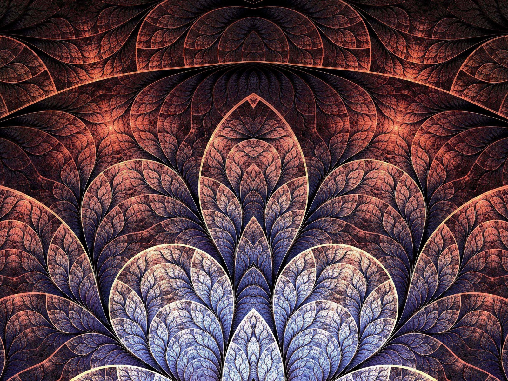

# ArtFusion

ArtFusion is a web application that empowers users to craft their own distinctive pieces of art by seamlessly merging
content and style from diverse images. True to its name, ArtFusion facilitates a creative synthesis of artistic
elements,
enabling users to explore imaginative possibilities in image composition.

The system allows you to choose style images from an existing database,
With the option of choosing different dominant colors that will appear in the servings.
or from different categories of art types, for example: Japanese, realist, symbolic, etc.

## Overview

ArtFusion provides a user-friendly interface for uploading two images: a content image and a style image.The content
image embodies the subject - content, while the style image encapsulates the desired artistic style. Through a
sophisticated algorithmic process, ArtFusion combines these images intelligently, producing a new image that inherits
the content from one and the stylistic essence from the other.

In addition, the system will constantly expand the image database in this way:
When a user uploads a picture, the system will save this picture in its database. (Of course, after a request), the
system will define the dominant colors in the picture using k-means clustering

### Example Scenario

For instance, envision a scenario where a user submits a content image featuring towering structures, juxtaposed with a
style image of the iconic artwork "The Scream" by Edvard Munch. ArtFusion seamlessly extracts the towers from the
content image and infuses them with the distinctive artistic style depicted in "The Scream," resulting in a new image
that exudes the emotive fervor of Munch's masterpiece, harmoniously intertwined with the architectural grandeur of the
towers.

  
  
  
   

[//]: # (  )

[//]: # (  )

[//]: # (  )

[//]: # (   )

[//]: # (  )

[//]: # (  )

[//]: # (  )

## Technology and Methodology

ArtFusion leverages a sophisticated design style transfer algorithm, underpinned by a fusion of advanced techniques from
computer vision and deep learning.

### Algorithm and Mathematics

#### Texture Loss

Texture loss is instrumental in guiding the neural network to reproduce the original image with emphasis on significant
features while disregarding trivial details. By utilizing activations from specific layers of the VGG19 Convolutional
Neural Network (CNN), ArtFusion ensures that the generated image captures essential content. Deeper convolutional layers
are preferred for their ability to abstract features and foster creativity,
striking a balance between fidelity to the original content and creative reinterpretation.

#### Final Loss

The final loss function harmonizes texture loss and perceptual loss, guiding the optimization process to synthesize an
image that embodies both the content and style characteristics specified by the user. Weighted contributions from
texture and style losses facilitate a gradual refinement process, ensuring that the generated image faithfully captures
the essence of the content while seamlessly adopting the desired artistic style.

## Experimentation and Customization

ArtFusion empowers users to experiment with various parameters and weights, offering opportunities for customization and
creative exploration. By fine-tuning the algorithm's parameters, users can tailor the fusion process to suit their
artistic vision, unlocking a realm of creative possibilities within the realm of digital artistry.

# Extending the database

A new photo uploaded by the user will be saved in the database (of course after a request)

### Art style

Training a model that classifies each art image into one of the five existing categories in the database
and will 

### Dominant colors

The system will deduce by using k-means clustering the dominant colors, dividing the three axes of the three primary
color components - red green blue, map the image to this cluster and deduce the dominant colors according to it.

### License

Free for personal or research use; for commercial use please contact me.